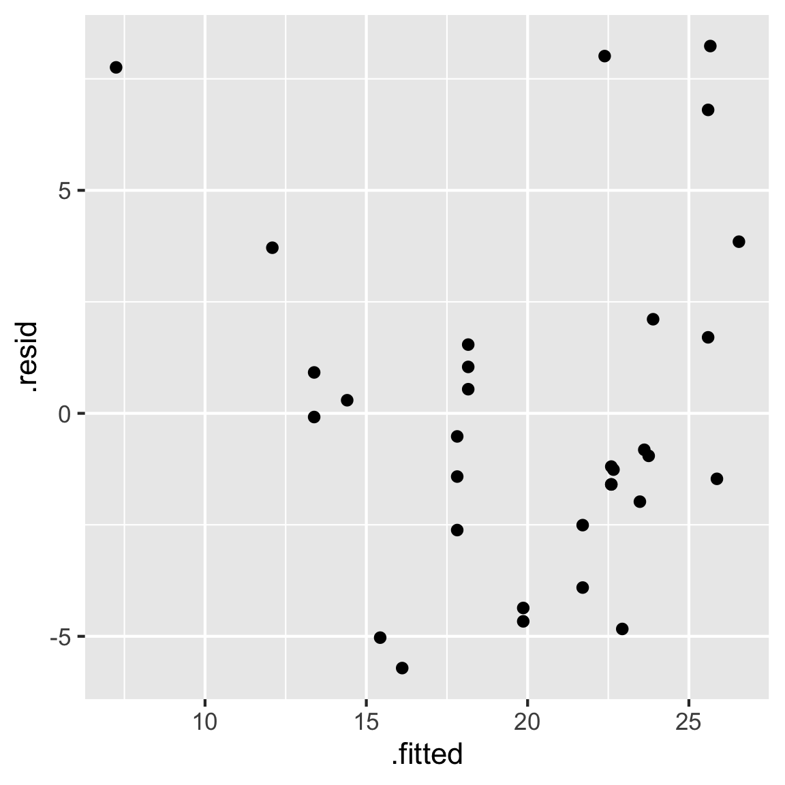

<!-- README.md is generated from README.Rmd. Please edit that file -->

# Some Guidance for Writing `alt text` for Data Plots

## Why?

Alt text provides a textual alternative to non-text content in HTML
documents. It serves various purposes:

- it is necessary to for accessibility guidelines.
- ensures your data visualisations communicate to everybody.
- assistive technologies can convert alt text into other formats such as
  speech or Braille, providing a description for people using screen
  reading software.
- alt text is displayed in place of the figure if it fails to load, or
  is viewed in a text-based browser.
- alt text can assist both general and image-specific search engines.

## Ingredients for writing alt text

The purpose of alt text is to describe what is in a plot for a person
who cannot see it. Generally, this means very basic explanation of the
elements of the plots. You wouldn’t typically interpret the plot,
especially if it is also accompanied by a caption. A caption assumes
that a person can see the plot, and provides additional context about
why it is included and what is the most important thing to learn. Thus,
the role of alt text is to provide the details of the plot elements for
someone unable ot see it, which would help to make the caption also more
understandable. When a caption doesn’t exist, then the alt text has to
play both roles.

The basic ingredients for alt text are:

- What kind of visualization is it (line graph, scatter plot, bar
  chart…)?
- What variables are on the axes?
- What is the range of the data?
- What is the aspect ratio.
- How are variables mapped to elements such as points, lines, violins or
  boxplots?
- What are the visible patterns (points are clustered in the top left
  and bottom right, lots of variability in size of the boxes of the
  boxplots, violins show a bimodal pattern, …) without interpreting
  them.

## Examples

``` r
library(ggplot2)
library(broom)
cars_lm <- lm(mpg ~ hp, data = mtcars)
cars_all <- augment(cars_lm)
ggplot(cars_all, aes(x=.fitted, y=.resid)) + 
  geom_point()
```



## Resources

This is a repo that explains how to make alt-text for data plots

- <https://medium.com/nightingale/writing-alt-text-for-data-visualization-2a218ef43f81>
- <https://lizharedogs.github.io/RLadiesNYAltText/#6>
- <https://medium.com/nightingale/writing-alt-text-for-data-visualization-2a218ef43f81>
- <https://www.w3.org/WAI/standards-guidelines/wcag/>
- <https://arbor-analytics.com/post/2023-06-30-making-r-graphs-more-accessible-using-brailler/>
- <https://www.w3.org/WAI/WCAG22/Techniques/html/H69.html>

## How to contribute

We welcome contributions! If you have a suggestion or addition please
post this as an
[issue](https://github.com/numbats/alt-text-for-data-plots/issues) on
GitHub.
