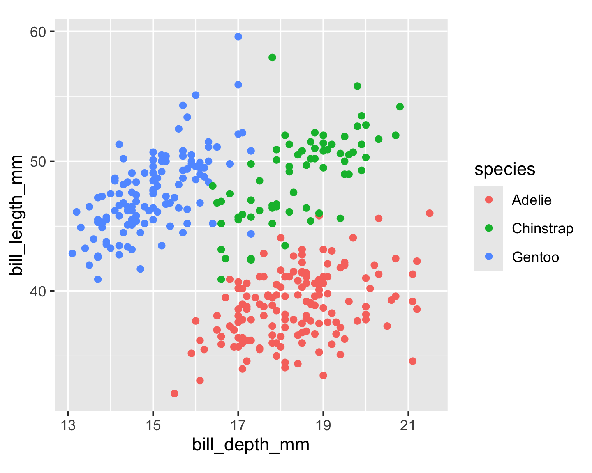

Some Guidance for Writing `alt text` for Data Plots
================

<!-- README.md is generated from README.Rmd. Please edit that file -->

## Why?

Alt text provides a textual alternative to non-text content in HTML
documents. It serves various purposes:

- it is necessary to for accessibility guidelines.
- ensures your data visualisations communicate to everybody.
- assistive technologies can convert alt text into other formats such as
  speech or Braille, providing a description for people using screen
  reading software.
- alt text is displayed in place of the figure if it fails to load, or
  is viewed in a text-based browser.
- alt text can assist both general and image-specific search engines.

## Ingredients for writing alt text

The purpose of alt text is to describe what is in a plot for a person
who cannot see it. Generally, this means very basic explanation of the
elements of the plots. You wouldn’t typically interpret the plot,
especially if it is also accompanied by a caption. A caption assumes
that a person can see the plot, and provides additional context about
why it is included and what is the most important thing to learn. Thus,
the role of alt text is to provide the details of the plot elements for
someone unable ot see it, which would help to make the caption also more
understandable. When a caption doesn’t exist, then the alt text has to
play both roles.

The basic ingredients for alt text are:

- What kind of visualization is it (line graph, scatter plot, bar
  chart…)?
- What variables are on the axes?
- What is the range of the data?
- What is the aspect ratio.
- How are variables mapped to elements such as points, lines, violins or
  boxplots?
- What are the visible patterns (points are clustered in the top left
  and bottom right, lots of variability in size of the boxes of the
  boxplots, violins show a bimodal pattern, …) without interpreting
  them.

## Examples

The examples are organised to show what would be written for some common
plots, in both `alt text` and a `caption`. Below is one example, shown
with different additions, and there are more examples available in the
[Examples](https://numbats.github.io/alt-text-for-data-plots/example.html)
page.

### Static scatterplot

The plot is generated from this code.

``` r
library(ggplot2)
library(palmerpenguins)
p <- penguins |>  
  ggplot(aes(x = bill_depth_mm, y = bill_length_mm, 
             color = species)) + 
  geom_point() +
  scale_x_continuous(breaks = seq(13, 22, 2)) +
  scale_y_continuous(breaks = seq(30, 60, 10)) +
  theme(aspect.ratio = 1)
p
```



**Alt text:** A scatter plot of the penguin’s data from the
palmerpenguin package. The plot has a bill depth (30 to 60mm) on the
x-axis and a bill length (13 to 22 mm) on the y-axis. There are three
species of penguins with different colour codes, Adelie (red), Chinstrap
(green), and Gentoo (blue). The Gentoo penguins have an elliptical shape
pointing to the top right, with the bill length ranging from 40 to 60 mm
and bill depth ranging from 13 to 17.5 mm. The Adelie penguins have an
elliptical shape pointing to the top right, with the bill length ranging
from 15 to 22 mm and bill depth ranging from 30 to 48 mm. The Chinstrap
has an elliptical shape pointing to the top right, with the bill length
ranging from 40 to 60 mm and bill depth ranging from 16 to 22 mm.

**Caption:** A basic non-interactive plot made with the ggplot2 package
on palmer penguin data. Three species of penguins are plotted with bill
depth on the x-axis and bill length on the y-axis. Visit the online
article to access the interactive version made with the plotly package.

## Using `BrailleR` to auto-generate

The [BrailleR](http://ajrgodfrey.github.io/BrailleR/index.html) package
provides a text description of a plot that is generated using
[ggplot2](https://ggplot2.tidyverse.org). Here is the description
generated for the plot shown above.

``` r
library(BrailleR)
VI(p)
## This is an untitled chart with no subtitle or caption.
## It has x-axis 'bill_depth_mm' with labels 13, 15, 17, 19 and 21.
## It has y-axis 'bill_length_mm' with labels 40, 50 and 60.
## There is a legend indicating colour is used to show species, with 3 levels:
## Adelie shown as strong reddish orange colour, 
## Chinstrap shown as vivid yellowish green colour and 
## Gentoo shown as brilliant blue colour.
## The chart is a set of 342 big solid circle points of which about 95% can be seen.
```

There are some differences to the alt text manually written. This is
focused on how the plot is constructed, which matches half of the
content. The missing part is the description of the patterns that can be
seen, which is very difficult to automate.

### Interactive elements can enhance accessibility

Adding mouse-over labels for scatterplots can help with providing more
information on demand.

``` r
library(plotly)
## 
## Attaching package: 'plotly'
## The following object is masked from 'package:ggplot2':
## 
##     last_plot
## The following object is masked from 'package:stats':
## 
##     filter
## The following object is masked from 'package:graphics':
## 
##     layout
ggplotly(p, width=500, height=400)
```

<div id="htmlwidget-b42023df81f99e648426" style="width:500px;height:400px;" class="plotly html-widget"></div>
<script type="application/json" data-for="htmlwidget-b42023df81f99e648426">{"x":{"data":[{"x":[18.699999999999999,17.399999999999999,18,null,19.300000000000001,20.600000000000001,17.800000000000001,19.600000000000001,18.100000000000001,20.199999999999999,17.100000000000001,17.300000000000001,17.600000000000001,21.199999999999999,21.100000000000001,17.800000000000001,19,20.699999999999999,18.399999999999999,21.5,18.300000000000001,18.699999999999999,19.199999999999999,18.100000000000001,17.199999999999999,18.899999999999999,18.600000000000001,17.899999999999999,18.600000000000001,18.899999999999999,16.699999999999999,18.100000000000001,17.800000000000001,18.899999999999999,17,21.100000000000001,20,18.5,19.300000000000001,19.100000000000001,18,18.399999999999999,18.5,19.699999999999999,16.899999999999999,18.800000000000001,19,18.899999999999999,17.899999999999999,21.199999999999999,17.699999999999999,18.899999999999999,17.899999999999999,19.5,18.100000000000001,18.600000000000001,17.5,18.800000000000001,16.600000000000001,19.100000000000001,16.899999999999999,21.100000000000001,17,18.199999999999999,17.100000000000001,18,16.199999999999999,19.100000000000001,16.600000000000001,19.399999999999999,19,18.399999999999999,17.199999999999999,18.899999999999999,17.5,18.5,16.800000000000001,19.399999999999999,16.100000000000001,19.100000000000001,17.199999999999999,17.600000000000001,18.800000000000001,19.399999999999999,17.800000000000001,20.300000000000001,19.5,18.600000000000001,19.199999999999999,18.800000000000001,18,18.100000000000001,17.100000000000001,18.100000000000001,17.300000000000001,18.899999999999999,18.600000000000001,18.5,16.100000000000001,18.5,17.899999999999999,20,16,20,18.600000000000001,18.899999999999999,17.199999999999999,20,17,19,16.5,20.300000000000001,17.699999999999999,19.5,20.699999999999999,18.300000000000001,17,20.5,17,18.600000000000001,17.199999999999999,19.800000000000001,17,18.5,15.9,19,17.600000000000001,18.300000000000001,17.100000000000001,18,17.899999999999999,19.199999999999999,18.5,18.5,17.600000000000001,17.5,17.5,20.100000000000001,16.5,17.899999999999999,17.100000000000001,17.199999999999999,15.5,17,16.800000000000001,18.699999999999999,18.600000000000001,18.399999999999999,17.800000000000001,18.100000000000001,17.100000000000001,18.5],"y":[39.100000000000001,39.5,40.299999999999997,null,36.700000000000003,39.299999999999997,38.899999999999999,39.200000000000003,34.100000000000001,42,37.799999999999997,37.799999999999997,41.100000000000001,38.600000000000001,34.600000000000001,36.600000000000001,38.700000000000003,42.5,34.399999999999999,46,37.799999999999997,37.700000000000003,35.899999999999999,38.200000000000003,38.799999999999997,35.299999999999997,40.600000000000001,40.5,37.899999999999999,40.5,39.5,37.200000000000003,39.5,40.899999999999999,36.399999999999999,39.200000000000003,38.799999999999997,42.200000000000003,37.600000000000001,39.799999999999997,36.5,40.799999999999997,36,44.100000000000001,37,39.600000000000001,41.100000000000001,37.5,36,42.299999999999997,39.600000000000001,40.100000000000001,35,42,34.5,41.399999999999999,39,40.600000000000001,36.5,37.600000000000001,35.700000000000003,41.299999999999997,37.600000000000001,41.100000000000001,36.399999999999999,41.600000000000001,35.5,41.100000000000001,35.899999999999999,41.799999999999997,33.5,39.700000000000003,39.600000000000001,45.799999999999997,35.5,42.799999999999997,40.899999999999999,37.200000000000003,36.200000000000003,42.100000000000001,34.600000000000001,42.899999999999999,36.700000000000003,35.100000000000001,37.299999999999997,41.299999999999997,36.299999999999997,36.899999999999999,38.299999999999997,38.899999999999999,35.700000000000003,41.100000000000001,34,39.600000000000001,36.200000000000003,40.799999999999997,38.100000000000001,40.299999999999997,33.100000000000001,43.200000000000003,35,41,37.700000000000003,37.799999999999997,37.899999999999999,39.700000000000003,38.600000000000001,38.200000000000003,38.100000000000001,43.200000000000003,38.100000000000001,45.600000000000001,39.700000000000003,42.200000000000003,39.600000000000001,42.700000000000003,38.600000000000001,37.299999999999997,35.700000000000003,41.100000000000001,36.200000000000003,37.700000000000003,40.200000000000003,41.399999999999999,35.200000000000003,40.600000000000001,38.799999999999997,41.5,39,44.100000000000001,38.5,43.100000000000001,36.799999999999997,37.5,38.100000000000001,41.100000000000001,35.600000000000001,40.200000000000003,37,39.700000000000003,40.200000000000003,40.600000000000001,32.100000000000001,40.700000000000003,37.299999999999997,39,39.200000000000003,36.600000000000001,36,37.799999999999997,36,41.5],"text":["bill_depth_mm: 18.7<br />bill_length_mm: 39.1<br />species: Adelie","bill_depth_mm: 17.4<br />bill_length_mm: 39.5<br />species: Adelie","bill_depth_mm: 18.0<br />bill_length_mm: 40.3<br />species: Adelie","bill_depth_mm:   NA<br />bill_length_mm:   NA<br />species: Adelie","bill_depth_mm: 19.3<br />bill_length_mm: 36.7<br />species: Adelie","bill_depth_mm: 20.6<br />bill_length_mm: 39.3<br />species: Adelie","bill_depth_mm: 17.8<br />bill_length_mm: 38.9<br />species: Adelie","bill_depth_mm: 19.6<br />bill_length_mm: 39.2<br />species: Adelie","bill_depth_mm: 18.1<br />bill_length_mm: 34.1<br />species: Adelie","bill_depth_mm: 20.2<br />bill_length_mm: 42.0<br />species: Adelie","bill_depth_mm: 17.1<br />bill_length_mm: 37.8<br />species: Adelie","bill_depth_mm: 17.3<br />bill_length_mm: 37.8<br />species: Adelie","bill_depth_mm: 17.6<br />bill_length_mm: 41.1<br />species: Adelie","bill_depth_mm: 21.2<br />bill_length_mm: 38.6<br />species: Adelie","bill_depth_mm: 21.1<br />bill_length_mm: 34.6<br />species: Adelie","bill_depth_mm: 17.8<br />bill_length_mm: 36.6<br />species: Adelie","bill_depth_mm: 19.0<br />bill_length_mm: 38.7<br />species: Adelie","bill_depth_mm: 20.7<br />bill_length_mm: 42.5<br />species: Adelie","bill_depth_mm: 18.4<br />bill_length_mm: 34.4<br />species: Adelie","bill_depth_mm: 21.5<br />bill_length_mm: 46.0<br />species: Adelie","bill_depth_mm: 18.3<br />bill_length_mm: 37.8<br />species: Adelie","bill_depth_mm: 18.7<br />bill_length_mm: 37.7<br />species: Adelie","bill_depth_mm: 19.2<br />bill_length_mm: 35.9<br />species: Adelie","bill_depth_mm: 18.1<br />bill_length_mm: 38.2<br />species: Adelie","bill_depth_mm: 17.2<br />bill_length_mm: 38.8<br />species: Adelie","bill_depth_mm: 18.9<br />bill_length_mm: 35.3<br />species: Adelie","bill_depth_mm: 18.6<br />bill_length_mm: 40.6<br />species: Adelie","bill_depth_mm: 17.9<br />bill_length_mm: 40.5<br />species: Adelie","bill_depth_mm: 18.6<br />bill_length_mm: 37.9<br />species: Adelie","bill_depth_mm: 18.9<br />bill_length_mm: 40.5<br />species: Adelie","bill_depth_mm: 16.7<br />bill_length_mm: 39.5<br />species: Adelie","bill_depth_mm: 18.1<br />bill_length_mm: 37.2<br />species: Adelie","bill_depth_mm: 17.8<br />bill_length_mm: 39.5<br />species: Adelie","bill_depth_mm: 18.9<br />bill_length_mm: 40.9<br />species: Adelie","bill_depth_mm: 17.0<br />bill_length_mm: 36.4<br />species: Adelie","bill_depth_mm: 21.1<br />bill_length_mm: 39.2<br />species: Adelie","bill_depth_mm: 20.0<br />bill_length_mm: 38.8<br />species: Adelie","bill_depth_mm: 18.5<br />bill_length_mm: 42.2<br />species: Adelie","bill_depth_mm: 19.3<br />bill_length_mm: 37.6<br />species: Adelie","bill_depth_mm: 19.1<br />bill_length_mm: 39.8<br />species: Adelie","bill_depth_mm: 18.0<br />bill_length_mm: 36.5<br />species: Adelie","bill_depth_mm: 18.4<br />bill_length_mm: 40.8<br />species: Adelie","bill_depth_mm: 18.5<br />bill_length_mm: 36.0<br />species: Adelie","bill_depth_mm: 19.7<br />bill_length_mm: 44.1<br />species: Adelie","bill_depth_mm: 16.9<br />bill_length_mm: 37.0<br />species: Adelie","bill_depth_mm: 18.8<br />bill_length_mm: 39.6<br />species: Adelie","bill_depth_mm: 19.0<br />bill_length_mm: 41.1<br />species: Adelie","bill_depth_mm: 18.9<br />bill_length_mm: 37.5<br />species: Adelie","bill_depth_mm: 17.9<br />bill_length_mm: 36.0<br />species: Adelie","bill_depth_mm: 21.2<br />bill_length_mm: 42.3<br />species: Adelie","bill_depth_mm: 17.7<br />bill_length_mm: 39.6<br />species: Adelie","bill_depth_mm: 18.9<br />bill_length_mm: 40.1<br />species: Adelie","bill_depth_mm: 17.9<br />bill_length_mm: 35.0<br />species: Adelie","bill_depth_mm: 19.5<br />bill_length_mm: 42.0<br />species: Adelie","bill_depth_mm: 18.1<br />bill_length_mm: 34.5<br />species: Adelie","bill_depth_mm: 18.6<br />bill_length_mm: 41.4<br />species: Adelie","bill_depth_mm: 17.5<br />bill_length_mm: 39.0<br />species: Adelie","bill_depth_mm: 18.8<br />bill_length_mm: 40.6<br />species: Adelie","bill_depth_mm: 16.6<br />bill_length_mm: 36.5<br />species: Adelie","bill_depth_mm: 19.1<br />bill_length_mm: 37.6<br />species: Adelie","bill_depth_mm: 16.9<br />bill_length_mm: 35.7<br />species: Adelie","bill_depth_mm: 21.1<br />bill_length_mm: 41.3<br />species: Adelie","bill_depth_mm: 17.0<br />bill_length_mm: 37.6<br />species: Adelie","bill_depth_mm: 18.2<br />bill_length_mm: 41.1<br />species: Adelie","bill_depth_mm: 17.1<br />bill_length_mm: 36.4<br />species: Adelie","bill_depth_mm: 18.0<br />bill_length_mm: 41.6<br />species: Adelie","bill_depth_mm: 16.2<br />bill_length_mm: 35.5<br />species: Adelie","bill_depth_mm: 19.1<br />bill_length_mm: 41.1<br />species: Adelie","bill_depth_mm: 16.6<br />bill_length_mm: 35.9<br />species: Adelie","bill_depth_mm: 19.4<br />bill_length_mm: 41.8<br />species: Adelie","bill_depth_mm: 19.0<br />bill_length_mm: 33.5<br />species: Adelie","bill_depth_mm: 18.4<br />bill_length_mm: 39.7<br />species: Adelie","bill_depth_mm: 17.2<br />bill_length_mm: 39.6<br />species: Adelie","bill_depth_mm: 18.9<br />bill_length_mm: 45.8<br />species: Adelie","bill_depth_mm: 17.5<br />bill_length_mm: 35.5<br />species: Adelie","bill_depth_mm: 18.5<br />bill_length_mm: 42.8<br />species: Adelie","bill_depth_mm: 16.8<br />bill_length_mm: 40.9<br />species: Adelie","bill_depth_mm: 19.4<br />bill_length_mm: 37.2<br />species: Adelie","bill_depth_mm: 16.1<br />bill_length_mm: 36.2<br />species: Adelie","bill_depth_mm: 19.1<br />bill_length_mm: 42.1<br />species: Adelie","bill_depth_mm: 17.2<br />bill_length_mm: 34.6<br />species: Adelie","bill_depth_mm: 17.6<br />bill_length_mm: 42.9<br />species: Adelie","bill_depth_mm: 18.8<br />bill_length_mm: 36.7<br />species: Adelie","bill_depth_mm: 19.4<br />bill_length_mm: 35.1<br />species: Adelie","bill_depth_mm: 17.8<br />bill_length_mm: 37.3<br />species: Adelie","bill_depth_mm: 20.3<br />bill_length_mm: 41.3<br />species: Adelie","bill_depth_mm: 19.5<br />bill_length_mm: 36.3<br />species: Adelie","bill_depth_mm: 18.6<br />bill_length_mm: 36.9<br />species: Adelie","bill_depth_mm: 19.2<br />bill_length_mm: 38.3<br />species: Adelie","bill_depth_mm: 18.8<br />bill_length_mm: 38.9<br />species: Adelie","bill_depth_mm: 18.0<br />bill_length_mm: 35.7<br />species: Adelie","bill_depth_mm: 18.1<br />bill_length_mm: 41.1<br />species: Adelie","bill_depth_mm: 17.1<br />bill_length_mm: 34.0<br />species: Adelie","bill_depth_mm: 18.1<br />bill_length_mm: 39.6<br />species: Adelie","bill_depth_mm: 17.3<br />bill_length_mm: 36.2<br />species: Adelie","bill_depth_mm: 18.9<br />bill_length_mm: 40.8<br />species: Adelie","bill_depth_mm: 18.6<br />bill_length_mm: 38.1<br />species: Adelie","bill_depth_mm: 18.5<br />bill_length_mm: 40.3<br />species: Adelie","bill_depth_mm: 16.1<br />bill_length_mm: 33.1<br />species: Adelie","bill_depth_mm: 18.5<br />bill_length_mm: 43.2<br />species: Adelie","bill_depth_mm: 17.9<br />bill_length_mm: 35.0<br />species: Adelie","bill_depth_mm: 20.0<br />bill_length_mm: 41.0<br />species: Adelie","bill_depth_mm: 16.0<br />bill_length_mm: 37.7<br />species: Adelie","bill_depth_mm: 20.0<br />bill_length_mm: 37.8<br />species: Adelie","bill_depth_mm: 18.6<br />bill_length_mm: 37.9<br />species: Adelie","bill_depth_mm: 18.9<br />bill_length_mm: 39.7<br />species: Adelie","bill_depth_mm: 17.2<br />bill_length_mm: 38.6<br />species: Adelie","bill_depth_mm: 20.0<br />bill_length_mm: 38.2<br />species: Adelie","bill_depth_mm: 17.0<br />bill_length_mm: 38.1<br />species: Adelie","bill_depth_mm: 19.0<br />bill_length_mm: 43.2<br />species: Adelie","bill_depth_mm: 16.5<br />bill_length_mm: 38.1<br />species: Adelie","bill_depth_mm: 20.3<br />bill_length_mm: 45.6<br />species: Adelie","bill_depth_mm: 17.7<br />bill_length_mm: 39.7<br />species: Adelie","bill_depth_mm: 19.5<br />bill_length_mm: 42.2<br />species: Adelie","bill_depth_mm: 20.7<br />bill_length_mm: 39.6<br />species: Adelie","bill_depth_mm: 18.3<br />bill_length_mm: 42.7<br />species: Adelie","bill_depth_mm: 17.0<br />bill_length_mm: 38.6<br />species: Adelie","bill_depth_mm: 20.5<br />bill_length_mm: 37.3<br />species: Adelie","bill_depth_mm: 17.0<br />bill_length_mm: 35.7<br />species: Adelie","bill_depth_mm: 18.6<br />bill_length_mm: 41.1<br />species: Adelie","bill_depth_mm: 17.2<br />bill_length_mm: 36.2<br />species: Adelie","bill_depth_mm: 19.8<br />bill_length_mm: 37.7<br />species: Adelie","bill_depth_mm: 17.0<br />bill_length_mm: 40.2<br />species: Adelie","bill_depth_mm: 18.5<br />bill_length_mm: 41.4<br />species: Adelie","bill_depth_mm: 15.9<br />bill_length_mm: 35.2<br />species: Adelie","bill_depth_mm: 19.0<br />bill_length_mm: 40.6<br />species: Adelie","bill_depth_mm: 17.6<br />bill_length_mm: 38.8<br />species: Adelie","bill_depth_mm: 18.3<br />bill_length_mm: 41.5<br />species: Adelie","bill_depth_mm: 17.1<br />bill_length_mm: 39.0<br />species: Adelie","bill_depth_mm: 18.0<br />bill_length_mm: 44.1<br />species: Adelie","bill_depth_mm: 17.9<br />bill_length_mm: 38.5<br />species: Adelie","bill_depth_mm: 19.2<br />bill_length_mm: 43.1<br />species: Adelie","bill_depth_mm: 18.5<br />bill_length_mm: 36.8<br />species: Adelie","bill_depth_mm: 18.5<br />bill_length_mm: 37.5<br />species: Adelie","bill_depth_mm: 17.6<br />bill_length_mm: 38.1<br />species: Adelie","bill_depth_mm: 17.5<br />bill_length_mm: 41.1<br />species: Adelie","bill_depth_mm: 17.5<br />bill_length_mm: 35.6<br />species: Adelie","bill_depth_mm: 20.1<br />bill_length_mm: 40.2<br />species: Adelie","bill_depth_mm: 16.5<br />bill_length_mm: 37.0<br />species: Adelie","bill_depth_mm: 17.9<br />bill_length_mm: 39.7<br />species: Adelie","bill_depth_mm: 17.1<br />bill_length_mm: 40.2<br />species: Adelie","bill_depth_mm: 17.2<br />bill_length_mm: 40.6<br />species: Adelie","bill_depth_mm: 15.5<br />bill_length_mm: 32.1<br />species: Adelie","bill_depth_mm: 17.0<br />bill_length_mm: 40.7<br />species: Adelie","bill_depth_mm: 16.8<br />bill_length_mm: 37.3<br />species: Adelie","bill_depth_mm: 18.7<br />bill_length_mm: 39.0<br />species: Adelie","bill_depth_mm: 18.6<br />bill_length_mm: 39.2<br />species: Adelie","bill_depth_mm: 18.4<br />bill_length_mm: 36.6<br />species: Adelie","bill_depth_mm: 17.8<br />bill_length_mm: 36.0<br />species: Adelie","bill_depth_mm: 18.1<br />bill_length_mm: 37.8<br />species: Adelie","bill_depth_mm: 17.1<br />bill_length_mm: 36.0<br />species: Adelie","bill_depth_mm: 18.5<br />bill_length_mm: 41.5<br />species: Adelie"],"type":"scatter","mode":"markers","marker":{"autocolorscale":false,"color":"rgba(248,118,109,1)","opacity":1,"size":5.6692913385826778,"symbol":"circle","line":{"width":1.8897637795275593,"color":"rgba(248,118,109,1)"}},"hoveron":"points","name":"Adelie","legendgroup":"Adelie","showlegend":true,"xaxis":"x","yaxis":"y","hoverinfo":"text","frame":null},{"x":[17.899999999999999,19.5,19.199999999999999,18.699999999999999,19.800000000000001,17.800000000000001,18.199999999999999,18.199999999999999,18.899999999999999,19.899999999999999,17.800000000000001,20.300000000000001,17.300000000000001,18.100000000000001,17.100000000000001,19.600000000000001,20,17.800000000000001,18.600000000000001,18.199999999999999,17.300000000000001,17.5,16.600000000000001,19.399999999999999,17.899999999999999,19,18.399999999999999,19,17.800000000000001,20,16.600000000000001,20.800000000000001,16.699999999999999,18.800000000000001,18.600000000000001,16.800000000000001,18.300000000000001,20.699999999999999,16.600000000000001,19.899999999999999,19.5,17.5,19.100000000000001,17,17.899999999999999,18.5,17.899999999999999,19.600000000000001,18.699999999999999,17.300000000000001,16.399999999999999,19,17.300000000000001,19.699999999999999,17.300000000000001,18.800000000000001,16.600000000000001,19.899999999999999,18.800000000000001,19.399999999999999,19.5,16.5,17,19.800000000000001,18.100000000000001,18.199999999999999,19,18.699999999999999],"y":[46.5,50,51.299999999999997,45.399999999999999,52.700000000000003,45.200000000000003,46.100000000000001,51.299999999999997,46,51.299999999999997,46.600000000000001,51.700000000000003,47,52,45.899999999999999,50.5,50.299999999999997,58,46.399999999999999,49.200000000000003,42.399999999999999,48.5,43.200000000000003,50.600000000000001,46.700000000000003,52,50.5,49.5,46.399999999999999,52.799999999999997,40.899999999999999,54.200000000000003,42.5,51,49.700000000000003,47.5,47.600000000000001,52,46.899999999999999,53.5,49,46.200000000000003,50.899999999999999,45.5,50.899999999999999,50.799999999999997,50.100000000000001,49,51.5,49.799999999999997,48.100000000000001,51.399999999999999,45.700000000000003,50.700000000000003,42.5,52.200000000000003,45.200000000000003,49.299999999999997,50.200000000000003,45.600000000000001,51.899999999999999,46.799999999999997,45.700000000000003,55.799999999999997,43.5,49.600000000000001,50.799999999999997,50.200000000000003],"text":["bill_depth_mm: 17.9<br />bill_length_mm: 46.5<br />species: Chinstrap","bill_depth_mm: 19.5<br />bill_length_mm: 50.0<br />species: Chinstrap","bill_depth_mm: 19.2<br />bill_length_mm: 51.3<br />species: Chinstrap","bill_depth_mm: 18.7<br />bill_length_mm: 45.4<br />species: Chinstrap","bill_depth_mm: 19.8<br />bill_length_mm: 52.7<br />species: Chinstrap","bill_depth_mm: 17.8<br />bill_length_mm: 45.2<br />species: Chinstrap","bill_depth_mm: 18.2<br />bill_length_mm: 46.1<br />species: Chinstrap","bill_depth_mm: 18.2<br />bill_length_mm: 51.3<br />species: Chinstrap","bill_depth_mm: 18.9<br />bill_length_mm: 46.0<br />species: Chinstrap","bill_depth_mm: 19.9<br />bill_length_mm: 51.3<br />species: Chinstrap","bill_depth_mm: 17.8<br />bill_length_mm: 46.6<br />species: Chinstrap","bill_depth_mm: 20.3<br />bill_length_mm: 51.7<br />species: Chinstrap","bill_depth_mm: 17.3<br />bill_length_mm: 47.0<br />species: Chinstrap","bill_depth_mm: 18.1<br />bill_length_mm: 52.0<br />species: Chinstrap","bill_depth_mm: 17.1<br />bill_length_mm: 45.9<br />species: Chinstrap","bill_depth_mm: 19.6<br />bill_length_mm: 50.5<br />species: Chinstrap","bill_depth_mm: 20.0<br />bill_length_mm: 50.3<br />species: Chinstrap","bill_depth_mm: 17.8<br />bill_length_mm: 58.0<br />species: Chinstrap","bill_depth_mm: 18.6<br />bill_length_mm: 46.4<br />species: Chinstrap","bill_depth_mm: 18.2<br />bill_length_mm: 49.2<br />species: Chinstrap","bill_depth_mm: 17.3<br />bill_length_mm: 42.4<br />species: Chinstrap","bill_depth_mm: 17.5<br />bill_length_mm: 48.5<br />species: Chinstrap","bill_depth_mm: 16.6<br />bill_length_mm: 43.2<br />species: Chinstrap","bill_depth_mm: 19.4<br />bill_length_mm: 50.6<br />species: Chinstrap","bill_depth_mm: 17.9<br />bill_length_mm: 46.7<br />species: Chinstrap","bill_depth_mm: 19.0<br />bill_length_mm: 52.0<br />species: Chinstrap","bill_depth_mm: 18.4<br />bill_length_mm: 50.5<br />species: Chinstrap","bill_depth_mm: 19.0<br />bill_length_mm: 49.5<br />species: Chinstrap","bill_depth_mm: 17.8<br />bill_length_mm: 46.4<br />species: Chinstrap","bill_depth_mm: 20.0<br />bill_length_mm: 52.8<br />species: Chinstrap","bill_depth_mm: 16.6<br />bill_length_mm: 40.9<br />species: Chinstrap","bill_depth_mm: 20.8<br />bill_length_mm: 54.2<br />species: Chinstrap","bill_depth_mm: 16.7<br />bill_length_mm: 42.5<br />species: Chinstrap","bill_depth_mm: 18.8<br />bill_length_mm: 51.0<br />species: Chinstrap","bill_depth_mm: 18.6<br />bill_length_mm: 49.7<br />species: Chinstrap","bill_depth_mm: 16.8<br />bill_length_mm: 47.5<br />species: Chinstrap","bill_depth_mm: 18.3<br />bill_length_mm: 47.6<br />species: Chinstrap","bill_depth_mm: 20.7<br />bill_length_mm: 52.0<br />species: Chinstrap","bill_depth_mm: 16.6<br />bill_length_mm: 46.9<br />species: Chinstrap","bill_depth_mm: 19.9<br />bill_length_mm: 53.5<br />species: Chinstrap","bill_depth_mm: 19.5<br />bill_length_mm: 49.0<br />species: Chinstrap","bill_depth_mm: 17.5<br />bill_length_mm: 46.2<br />species: Chinstrap","bill_depth_mm: 19.1<br />bill_length_mm: 50.9<br />species: Chinstrap","bill_depth_mm: 17.0<br />bill_length_mm: 45.5<br />species: Chinstrap","bill_depth_mm: 17.9<br />bill_length_mm: 50.9<br />species: Chinstrap","bill_depth_mm: 18.5<br />bill_length_mm: 50.8<br />species: Chinstrap","bill_depth_mm: 17.9<br />bill_length_mm: 50.1<br />species: Chinstrap","bill_depth_mm: 19.6<br />bill_length_mm: 49.0<br />species: Chinstrap","bill_depth_mm: 18.7<br />bill_length_mm: 51.5<br />species: Chinstrap","bill_depth_mm: 17.3<br />bill_length_mm: 49.8<br />species: Chinstrap","bill_depth_mm: 16.4<br />bill_length_mm: 48.1<br />species: Chinstrap","bill_depth_mm: 19.0<br />bill_length_mm: 51.4<br />species: Chinstrap","bill_depth_mm: 17.3<br />bill_length_mm: 45.7<br />species: Chinstrap","bill_depth_mm: 19.7<br />bill_length_mm: 50.7<br />species: Chinstrap","bill_depth_mm: 17.3<br />bill_length_mm: 42.5<br />species: Chinstrap","bill_depth_mm: 18.8<br />bill_length_mm: 52.2<br />species: Chinstrap","bill_depth_mm: 16.6<br />bill_length_mm: 45.2<br />species: Chinstrap","bill_depth_mm: 19.9<br />bill_length_mm: 49.3<br />species: Chinstrap","bill_depth_mm: 18.8<br />bill_length_mm: 50.2<br />species: Chinstrap","bill_depth_mm: 19.4<br />bill_length_mm: 45.6<br />species: Chinstrap","bill_depth_mm: 19.5<br />bill_length_mm: 51.9<br />species: Chinstrap","bill_depth_mm: 16.5<br />bill_length_mm: 46.8<br />species: Chinstrap","bill_depth_mm: 17.0<br />bill_length_mm: 45.7<br />species: Chinstrap","bill_depth_mm: 19.8<br />bill_length_mm: 55.8<br />species: Chinstrap","bill_depth_mm: 18.1<br />bill_length_mm: 43.5<br />species: Chinstrap","bill_depth_mm: 18.2<br />bill_length_mm: 49.6<br />species: Chinstrap","bill_depth_mm: 19.0<br />bill_length_mm: 50.8<br />species: Chinstrap","bill_depth_mm: 18.7<br />bill_length_mm: 50.2<br />species: Chinstrap"],"type":"scatter","mode":"markers","marker":{"autocolorscale":false,"color":"rgba(0,186,56,1)","opacity":1,"size":5.6692913385826778,"symbol":"circle","line":{"width":1.8897637795275593,"color":"rgba(0,186,56,1)"}},"hoveron":"points","name":"Chinstrap","legendgroup":"Chinstrap","showlegend":true,"xaxis":"x","yaxis":"y","hoverinfo":"text","frame":null},{"x":[13.199999999999999,16.300000000000001,14.1,15.199999999999999,14.5,13.5,14.6,15.300000000000001,13.4,15.4,13.699999999999999,16.100000000000001,13.699999999999999,14.6,14.6,15.699999999999999,13.5,15.199999999999999,14.5,15.1,14.300000000000001,14.5,14.5,15.800000000000001,13.1,15.1,14.300000000000001,15,14.300000000000001,15.300000000000001,15.300000000000001,14.199999999999999,14.5,17,14.800000000000001,16.300000000000001,13.699999999999999,17.300000000000001,13.6,15.699999999999999,13.699999999999999,16,13.699999999999999,15,15.9,13.9,13.9,15.9,13.300000000000001,15.800000000000001,14.199999999999999,14.1,14.4,15,14.4,15.4,13.9,15,14.5,15.300000000000001,13.800000000000001,14.9,13.9,15.699999999999999,14.199999999999999,16.800000000000001,14.4,16.199999999999999,14.199999999999999,15,15,15.6,15.6,14.800000000000001,15,16,14.199999999999999,16.300000000000001,13.800000000000001,16.399999999999999,14.5,15.6,14.6,15.9,13.800000000000001,17.300000000000001,14.4,14.199999999999999,14,17,15,17.100000000000001,14.5,16.100000000000001,14.699999999999999,15.699999999999999,15.800000000000001,14.6,14.4,16.5,15,17,15.5,15,13.800000000000001,16.100000000000001,14.699999999999999,15.800000000000001,14,15.1,15.199999999999999,15.9,15.199999999999999,16.300000000000001,14.1,16,15.699999999999999,16.199999999999999,13.699999999999999,null,14.300000000000001,15.699999999999999,14.800000000000001,16.100000000000001],"y":[46.100000000000001,50,48.700000000000003,50,47.600000000000001,46.5,45.399999999999999,46.700000000000003,43.299999999999997,46.799999999999997,40.899999999999999,49,45.5,48.399999999999999,45.799999999999997,49.299999999999997,42,49.200000000000003,46.200000000000003,48.700000000000003,50.200000000000003,45.100000000000001,46.5,46.299999999999997,42.899999999999999,46.100000000000001,44.5,47.799999999999997,48.200000000000003,50,47.299999999999997,42.799999999999997,45.100000000000001,59.600000000000001,49.100000000000001,48.399999999999999,42.600000000000001,44.399999999999999,44,48.700000000000003,42.700000000000003,49.600000000000001,45.299999999999997,49.600000000000001,50.5,43.600000000000001,45.5,50.5,44.899999999999999,45.200000000000003,46.600000000000001,48.5,45.100000000000001,50.100000000000001,46.5,45,43.799999999999997,45.5,43.200000000000003,50.399999999999999,45.299999999999997,46.200000000000003,45.700000000000003,54.299999999999997,45.799999999999997,49.799999999999997,46.200000000000003,49.5,43.5,50.700000000000003,47.700000000000003,46.399999999999999,48.200000000000003,46.5,46.399999999999999,48.600000000000001,47.5,51.100000000000001,45.200000000000003,45.200000000000003,49.100000000000001,52.5,47.399999999999999,50,44.899999999999999,50.799999999999997,43.399999999999999,51.299999999999997,47.5,52.100000000000001,47.5,52.200000000000003,45.5,49.5,44.5,50.799999999999997,49.399999999999999,46.899999999999999,48.399999999999999,51.100000000000001,48.5,55.899999999999999,47.200000000000003,49.100000000000001,47.299999999999997,46.799999999999997,41.700000000000003,53.399999999999999,43.299999999999997,48.100000000000001,50.5,49.799999999999997,43.5,51.5,46.200000000000003,55.100000000000001,44.5,48.799999999999997,47.200000000000003,null,46.799999999999997,50.399999999999999,45.200000000000003,49.899999999999999],"text":["bill_depth_mm: 13.2<br />bill_length_mm: 46.1<br />species: Gentoo","bill_depth_mm: 16.3<br />bill_length_mm: 50.0<br />species: Gentoo","bill_depth_mm: 14.1<br />bill_length_mm: 48.7<br />species: Gentoo","bill_depth_mm: 15.2<br />bill_length_mm: 50.0<br />species: Gentoo","bill_depth_mm: 14.5<br />bill_length_mm: 47.6<br />species: Gentoo","bill_depth_mm: 13.5<br />bill_length_mm: 46.5<br />species: Gentoo","bill_depth_mm: 14.6<br />bill_length_mm: 45.4<br />species: Gentoo","bill_depth_mm: 15.3<br />bill_length_mm: 46.7<br />species: Gentoo","bill_depth_mm: 13.4<br />bill_length_mm: 43.3<br />species: Gentoo","bill_depth_mm: 15.4<br />bill_length_mm: 46.8<br />species: Gentoo","bill_depth_mm: 13.7<br />bill_length_mm: 40.9<br />species: Gentoo","bill_depth_mm: 16.1<br />bill_length_mm: 49.0<br />species: Gentoo","bill_depth_mm: 13.7<br />bill_length_mm: 45.5<br />species: Gentoo","bill_depth_mm: 14.6<br />bill_length_mm: 48.4<br />species: Gentoo","bill_depth_mm: 14.6<br />bill_length_mm: 45.8<br />species: Gentoo","bill_depth_mm: 15.7<br />bill_length_mm: 49.3<br />species: Gentoo","bill_depth_mm: 13.5<br />bill_length_mm: 42.0<br />species: Gentoo","bill_depth_mm: 15.2<br />bill_length_mm: 49.2<br />species: Gentoo","bill_depth_mm: 14.5<br />bill_length_mm: 46.2<br />species: Gentoo","bill_depth_mm: 15.1<br />bill_length_mm: 48.7<br />species: Gentoo","bill_depth_mm: 14.3<br />bill_length_mm: 50.2<br />species: Gentoo","bill_depth_mm: 14.5<br />bill_length_mm: 45.1<br />species: Gentoo","bill_depth_mm: 14.5<br />bill_length_mm: 46.5<br />species: Gentoo","bill_depth_mm: 15.8<br />bill_length_mm: 46.3<br />species: Gentoo","bill_depth_mm: 13.1<br />bill_length_mm: 42.9<br />species: Gentoo","bill_depth_mm: 15.1<br />bill_length_mm: 46.1<br />species: Gentoo","bill_depth_mm: 14.3<br />bill_length_mm: 44.5<br />species: Gentoo","bill_depth_mm: 15.0<br />bill_length_mm: 47.8<br />species: Gentoo","bill_depth_mm: 14.3<br />bill_length_mm: 48.2<br />species: Gentoo","bill_depth_mm: 15.3<br />bill_length_mm: 50.0<br />species: Gentoo","bill_depth_mm: 15.3<br />bill_length_mm: 47.3<br />species: Gentoo","bill_depth_mm: 14.2<br />bill_length_mm: 42.8<br />species: Gentoo","bill_depth_mm: 14.5<br />bill_length_mm: 45.1<br />species: Gentoo","bill_depth_mm: 17.0<br />bill_length_mm: 59.6<br />species: Gentoo","bill_depth_mm: 14.8<br />bill_length_mm: 49.1<br />species: Gentoo","bill_depth_mm: 16.3<br />bill_length_mm: 48.4<br />species: Gentoo","bill_depth_mm: 13.7<br />bill_length_mm: 42.6<br />species: Gentoo","bill_depth_mm: 17.3<br />bill_length_mm: 44.4<br />species: Gentoo","bill_depth_mm: 13.6<br />bill_length_mm: 44.0<br />species: Gentoo","bill_depth_mm: 15.7<br />bill_length_mm: 48.7<br />species: Gentoo","bill_depth_mm: 13.7<br />bill_length_mm: 42.7<br />species: Gentoo","bill_depth_mm: 16.0<br />bill_length_mm: 49.6<br />species: Gentoo","bill_depth_mm: 13.7<br />bill_length_mm: 45.3<br />species: Gentoo","bill_depth_mm: 15.0<br />bill_length_mm: 49.6<br />species: Gentoo","bill_depth_mm: 15.9<br />bill_length_mm: 50.5<br />species: Gentoo","bill_depth_mm: 13.9<br />bill_length_mm: 43.6<br />species: Gentoo","bill_depth_mm: 13.9<br />bill_length_mm: 45.5<br />species: Gentoo","bill_depth_mm: 15.9<br />bill_length_mm: 50.5<br />species: Gentoo","bill_depth_mm: 13.3<br />bill_length_mm: 44.9<br />species: Gentoo","bill_depth_mm: 15.8<br />bill_length_mm: 45.2<br />species: Gentoo","bill_depth_mm: 14.2<br />bill_length_mm: 46.6<br />species: Gentoo","bill_depth_mm: 14.1<br />bill_length_mm: 48.5<br />species: Gentoo","bill_depth_mm: 14.4<br />bill_length_mm: 45.1<br />species: Gentoo","bill_depth_mm: 15.0<br />bill_length_mm: 50.1<br />species: Gentoo","bill_depth_mm: 14.4<br />bill_length_mm: 46.5<br />species: Gentoo","bill_depth_mm: 15.4<br />bill_length_mm: 45.0<br />species: Gentoo","bill_depth_mm: 13.9<br />bill_length_mm: 43.8<br />species: Gentoo","bill_depth_mm: 15.0<br />bill_length_mm: 45.5<br />species: Gentoo","bill_depth_mm: 14.5<br />bill_length_mm: 43.2<br />species: Gentoo","bill_depth_mm: 15.3<br />bill_length_mm: 50.4<br />species: Gentoo","bill_depth_mm: 13.8<br />bill_length_mm: 45.3<br />species: Gentoo","bill_depth_mm: 14.9<br />bill_length_mm: 46.2<br />species: Gentoo","bill_depth_mm: 13.9<br />bill_length_mm: 45.7<br />species: Gentoo","bill_depth_mm: 15.7<br />bill_length_mm: 54.3<br />species: Gentoo","bill_depth_mm: 14.2<br />bill_length_mm: 45.8<br />species: Gentoo","bill_depth_mm: 16.8<br />bill_length_mm: 49.8<br />species: Gentoo","bill_depth_mm: 14.4<br />bill_length_mm: 46.2<br />species: Gentoo","bill_depth_mm: 16.2<br />bill_length_mm: 49.5<br />species: Gentoo","bill_depth_mm: 14.2<br />bill_length_mm: 43.5<br />species: Gentoo","bill_depth_mm: 15.0<br />bill_length_mm: 50.7<br />species: Gentoo","bill_depth_mm: 15.0<br />bill_length_mm: 47.7<br />species: Gentoo","bill_depth_mm: 15.6<br />bill_length_mm: 46.4<br />species: Gentoo","bill_depth_mm: 15.6<br />bill_length_mm: 48.2<br />species: Gentoo","bill_depth_mm: 14.8<br />bill_length_mm: 46.5<br />species: Gentoo","bill_depth_mm: 15.0<br />bill_length_mm: 46.4<br />species: Gentoo","bill_depth_mm: 16.0<br />bill_length_mm: 48.6<br />species: Gentoo","bill_depth_mm: 14.2<br />bill_length_mm: 47.5<br />species: Gentoo","bill_depth_mm: 16.3<br />bill_length_mm: 51.1<br />species: Gentoo","bill_depth_mm: 13.8<br />bill_length_mm: 45.2<br />species: Gentoo","bill_depth_mm: 16.4<br />bill_length_mm: 45.2<br />species: Gentoo","bill_depth_mm: 14.5<br />bill_length_mm: 49.1<br />species: Gentoo","bill_depth_mm: 15.6<br />bill_length_mm: 52.5<br />species: Gentoo","bill_depth_mm: 14.6<br />bill_length_mm: 47.4<br />species: Gentoo","bill_depth_mm: 15.9<br />bill_length_mm: 50.0<br />species: Gentoo","bill_depth_mm: 13.8<br />bill_length_mm: 44.9<br />species: Gentoo","bill_depth_mm: 17.3<br />bill_length_mm: 50.8<br />species: Gentoo","bill_depth_mm: 14.4<br />bill_length_mm: 43.4<br />species: Gentoo","bill_depth_mm: 14.2<br />bill_length_mm: 51.3<br />species: Gentoo","bill_depth_mm: 14.0<br />bill_length_mm: 47.5<br />species: Gentoo","bill_depth_mm: 17.0<br />bill_length_mm: 52.1<br />species: Gentoo","bill_depth_mm: 15.0<br />bill_length_mm: 47.5<br />species: Gentoo","bill_depth_mm: 17.1<br />bill_length_mm: 52.2<br />species: Gentoo","bill_depth_mm: 14.5<br />bill_length_mm: 45.5<br />species: Gentoo","bill_depth_mm: 16.1<br />bill_length_mm: 49.5<br />species: Gentoo","bill_depth_mm: 14.7<br />bill_length_mm: 44.5<br />species: Gentoo","bill_depth_mm: 15.7<br />bill_length_mm: 50.8<br />species: Gentoo","bill_depth_mm: 15.8<br />bill_length_mm: 49.4<br />species: Gentoo","bill_depth_mm: 14.6<br />bill_length_mm: 46.9<br />species: Gentoo","bill_depth_mm: 14.4<br />bill_length_mm: 48.4<br />species: Gentoo","bill_depth_mm: 16.5<br />bill_length_mm: 51.1<br />species: Gentoo","bill_depth_mm: 15.0<br />bill_length_mm: 48.5<br />species: Gentoo","bill_depth_mm: 17.0<br />bill_length_mm: 55.9<br />species: Gentoo","bill_depth_mm: 15.5<br />bill_length_mm: 47.2<br />species: Gentoo","bill_depth_mm: 15.0<br />bill_length_mm: 49.1<br />species: Gentoo","bill_depth_mm: 13.8<br />bill_length_mm: 47.3<br />species: Gentoo","bill_depth_mm: 16.1<br />bill_length_mm: 46.8<br />species: Gentoo","bill_depth_mm: 14.7<br />bill_length_mm: 41.7<br />species: Gentoo","bill_depth_mm: 15.8<br />bill_length_mm: 53.4<br />species: Gentoo","bill_depth_mm: 14.0<br />bill_length_mm: 43.3<br />species: Gentoo","bill_depth_mm: 15.1<br />bill_length_mm: 48.1<br />species: Gentoo","bill_depth_mm: 15.2<br />bill_length_mm: 50.5<br />species: Gentoo","bill_depth_mm: 15.9<br />bill_length_mm: 49.8<br />species: Gentoo","bill_depth_mm: 15.2<br />bill_length_mm: 43.5<br />species: Gentoo","bill_depth_mm: 16.3<br />bill_length_mm: 51.5<br />species: Gentoo","bill_depth_mm: 14.1<br />bill_length_mm: 46.2<br />species: Gentoo","bill_depth_mm: 16.0<br />bill_length_mm: 55.1<br />species: Gentoo","bill_depth_mm: 15.7<br />bill_length_mm: 44.5<br />species: Gentoo","bill_depth_mm: 16.2<br />bill_length_mm: 48.8<br />species: Gentoo","bill_depth_mm: 13.7<br />bill_length_mm: 47.2<br />species: Gentoo","bill_depth_mm:   NA<br />bill_length_mm:   NA<br />species: Gentoo","bill_depth_mm: 14.3<br />bill_length_mm: 46.8<br />species: Gentoo","bill_depth_mm: 15.7<br />bill_length_mm: 50.4<br />species: Gentoo","bill_depth_mm: 14.8<br />bill_length_mm: 45.2<br />species: Gentoo","bill_depth_mm: 16.1<br />bill_length_mm: 49.9<br />species: Gentoo"],"type":"scatter","mode":"markers","marker":{"autocolorscale":false,"color":"rgba(97,156,255,1)","opacity":1,"size":5.6692913385826778,"symbol":"circle","line":{"width":1.8897637795275593,"color":"rgba(97,156,255,1)"}},"hoveron":"points","name":"Gentoo","legendgroup":"Gentoo","showlegend":true,"xaxis":"x","yaxis":"y","hoverinfo":"text","frame":null}],"layout":{"margin":{"t":25.132420091324203,"r":7.3059360730593621,"b":39.086757990867589,"l":37.260273972602747},"plot_bgcolor":"rgba(235,235,235,1)","paper_bgcolor":"rgba(255,255,255,1)","font":{"color":"rgba(0,0,0,1)","family":"","size":14.611872146118724},"xaxis":{"domain":[0,1],"automargin":true,"type":"linear","autorange":false,"range":[12.68,21.920000000000002],"tickmode":"array","ticktext":["13","15","17","19","21"],"tickvals":[13,15,17,19,21],"categoryorder":"array","categoryarray":["13","15","17","19","21"],"nticks":null,"ticks":"outside","tickcolor":"rgba(51,51,51,1)","ticklen":3.6529680365296811,"tickwidth":0.66417600664176002,"showticklabels":true,"tickfont":{"color":"rgba(77,77,77,1)","family":"","size":11.68949771689498},"tickangle":-0,"showline":false,"linecolor":null,"linewidth":0,"showgrid":true,"gridcolor":"rgba(255,255,255,1)","gridwidth":0.66417600664176002,"zeroline":false,"anchor":"y","title":{"text":"bill_depth_mm","font":{"color":"rgba(0,0,0,1)","family":"","size":14.611872146118724}},"hoverformat":".2f"},"yaxis":{"domain":[0,1],"automargin":true,"type":"linear","autorange":false,"range":[30.725000000000001,60.975000000000001],"tickmode":"array","ticktext":["40","50","60"],"tickvals":[40,50,60],"categoryorder":"array","categoryarray":["40","50","60"],"nticks":null,"ticks":"outside","tickcolor":"rgba(51,51,51,1)","ticklen":3.6529680365296811,"tickwidth":0.66417600664176002,"showticklabels":true,"tickfont":{"color":"rgba(77,77,77,1)","family":"","size":11.68949771689498},"tickangle":-0,"showline":false,"linecolor":null,"linewidth":0,"showgrid":true,"gridcolor":"rgba(255,255,255,1)","gridwidth":0.66417600664176002,"zeroline":false,"anchor":"x","title":{"text":"bill_length_mm","font":{"color":"rgba(0,0,0,1)","family":"","size":14.611872146118724}},"hoverformat":".2f"},"shapes":[{"type":"rect","fillcolor":null,"line":{"color":null,"width":0,"linetype":[]},"yref":"paper","xref":"paper","x0":0,"x1":1,"y0":0,"y1":1}],"showlegend":true,"legend":{"bgcolor":"rgba(255,255,255,1)","bordercolor":"transparent","borderwidth":1.8897637795275593,"font":{"color":"rgba(0,0,0,1)","family":"","size":11.68949771689498},"title":{"text":"species","font":{"color":"rgba(0,0,0,1)","family":"","size":14.611872146118724}}},"hovermode":"closest","width":500,"height":400,"barmode":"relative"},"config":{"doubleClick":"reset","modeBarButtonsToAdd":["hoverclosest","hovercompare"],"showSendToCloud":false},"source":"A","attrs":{"2b12190c7de0":{"x":{},"y":{},"colour":{},"type":"scatter"}},"cur_data":"2b12190c7de0","visdat":{"2b12190c7de0":["function (y) ","x"]},"highlight":{"on":"plotly_click","persistent":false,"dynamic":false,"selectize":false,"opacityDim":0.20000000000000001,"selected":{"opacity":1},"debounce":0},"shinyEvents":["plotly_hover","plotly_click","plotly_selected","plotly_relayout","plotly_brushed","plotly_brushing","plotly_clickannotation","plotly_doubleclick","plotly_deselect","plotly_afterplot","plotly_sunburstclick"],"base_url":"https://plot.ly"},"evals":[],"jsHooks":[]}</script>

Generally, additional `label` details to the `aes()` in ggplot, or using
`ggplotly()` parameters, provides more careful details of what to show
on the pop-up text. Using sound to speak the label might make if even
more accessible, like the [Vowel
explorer](https://petergill.shinyapps.io/shinyplay/).

## Resources

There are many sites describing the purpose of writing alt text. None
provides concrete explanations of documenting data plots. Here is our
list of general resources related to alt text:

- [Liz Hare’s
  presentation](https://lizharedogs.github.io/RLadiesNYAltText/#6)
- [Amy Cesal’s Medium
  Post](https://medium.com/nightingale/writing-alt-text-for-data-visualization-2a218)ef43f81
- [Matt Russell’s blog post on the BrailleR
  package](https://arbor-analytics.com/post/2023-06-30-making-r-graphs-more-accessible-using-brailler/)
- [WCAG 2 Overview](https://www.w3.org/WAI/standards-guidelines/wcag/)
- [WCAG 2.2
  Techniques](https://www.w3.org/WAI/WCAG22/Techniques/html/H69.html)
- [The DAISY Consortium](https://daisy.org)
- [latest guidelines](https://www.w3.org/TR/maturity-model/)

## How to contribute

We welcome contributions! If you have a suggestion or addition please
post this as an
[issue](https://github.com/numbats/alt-text-for-data-plots/issues) on
GitHub.
