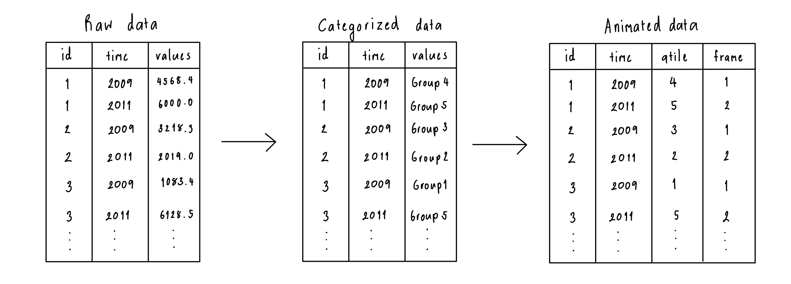

```{r, include = FALSE}
knitr::opts_chunk$set(
  collapse = TRUE, 
  comment = "#>", 
  fig.path = "figures/",
  fig.retina = 3,
  out.width = "100%"
)
```

## Example

### Data diagram



**Alt text:** A diagram showing the data processing step starting from the raw to categorized and ending with animated data structure. There are three tables, Raw data, Categorized data, and Animated data. The Raw data have three columns, id, time, and values. It then got converted to a Categorized structure with three columns id, time, and values. The difference is the values column is in numerical format for the raw data structure, whereas values for the categorized structure are categorical variables. The last structure is called Animated data which is the transformation from the categorized data. There are four columns, id, time, qtile, and frame. The qtile column represents the category and the frame is assigned based on the unique ID.

**Caption:** The animation expects data with an ID and a time variable, along with a numerical variable (raw form), which is possibly converted to categorical (categorized). The data can be provided in the raw or categorized form and will be processed into the format needed for the animation, where the categorical variable is treated as a quantile and an animation frame variable is created. 


### Scatter plot (static)

The plot is generated from this code. 

```{r}
#| label: resid-plot
#| fig-width: 4
#| fig-height: 4
#| out-width: 40%
library(ggplot2)
library(broom)
cars_lm <- lm(mpg ~ hp, data = mtcars)
cars_all <- augment(cars_lm)
ggplot(cars_all, aes(x=.fitted, y=.resid)) + 
  geom_point()
```

**Alt text**: Scatterplot of fitted values on the x-axis and residual values on the vertical axis. The x-axis has tick marks 10, 15, 20, 25, and the y-axis has tick marks -5, 0, 5. There is a slight U-shape patterns to the points with one point with lower x-value than others at -12.5, and a high y-value of 7.5.

**Caption**: Examining the fit of a linear model of miles per gallon on horsepower. Residuals are plotted vertically and fitted values horizontally. The pattern suggests some non-linear relationship is not captured by the model.

### Boxplot

```{r}
#| label: boxplot
#| fig-width: 4
#| fig-height: 4
#| out-width: 40%
library(nullabor)
data(electoral)
ggplot(electoral$polls, 
       aes(x=Democrat, 
           y=Margin)) +
  geom_boxplot() +
  theme(aspect.ratio = 1.2, 
        panel.grid.major.x = element_blank())
```

**Alt text**: Side-by-side boxplots of vote margin for Democrat=TRUE or FALSE. The the y-axis has tick marks at 0, 25, 50, 75. The median for TRUE is around 12, and for FALSE is around 20. The box for the TRUE is about twice as big that of FALSE. Each group has an outlier, at about 80 for TRUE and around 45 for FALSE.

### Barchart

```{r}
#| label: barchart
#| fig-width: 4
#| fig-height: 4
#| out-width: 40%
ggplot(mpg, aes(x=class, weight = displ)) +
  geom_bar() +
  coord_flip()
```

**Alt text**: Bar chart of numbers of different classes of vehicles. 

### Animated visualisation


**Alt text:** An animated visualisation with an s-curve shaded area showing the proportion shift from one category (2016) to another (2019). It shows the liberal voters shifting behaviour according to gender identification from the 2016 and 2019 surveys. There are three gender identifications, male, female, and other. Most of the voters remain in the same party where a small fraction of voters with roughly equal male-to-female ratio switch to other major parties such as Labor, Greens, and National. Some decided not to vote. People who identified themselves as other have all shifted to the Green Party.

**Caption:** The wallaby plot visualization shows how the top party performs in keeping the old voters of different genders. Most voters remain loyal to the party, but a small fraction of voters with roughly equal male-to-female ratio switch primarily to the other major party. Interestingly, the few individuals who identified as neither male nor female overwhelmingly shifted their party affiliations to the Greens. 
